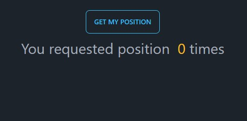

# use-Geolocation App Challenge 📌

## Features

- useState and state management
- Tailwind css
- prop types
- useEffect
- custom hooks
- data fetch
- component composition and reusability

## Demo

You can check out the live demo [here](https://use-geolocation.vercel.app/)


## Screenshots



## Run Locally

Clone the project

```bash
  git clone https://link-to-project
```

Go to the project directory

```bash
  cd my-project
```

Install dependencies

```bash
  npm install
```

Start the server

```bash
  npm start
```

## API Usage

#### This app utilizes the Frankfurter API to fetch the latest exchange rates. The API is accessed using the fetch function provided by the browser.

### The API endpoint used for openstreetmap is:

```
`https://www.openstreetmap.org/#map=16/${lat}/${lng}`
```

## Acknowledgements

This my finished React App useGeolocation Challenge 📌 PART- 2 Challenge - 3 based on A Ultimate React Course by Jonas Schmedtmann

As the description suggests, the original design was done by Jonas Schmedtmann and was part of a Ultimate React Course which I highly recommend. https://www.udemy.com/course/the-ultimate-react-course/

## License

[MIT](https://choosealicense.com/licenses/mit/)
